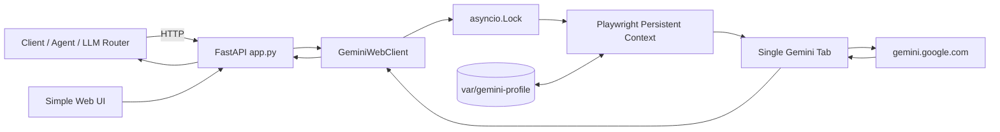
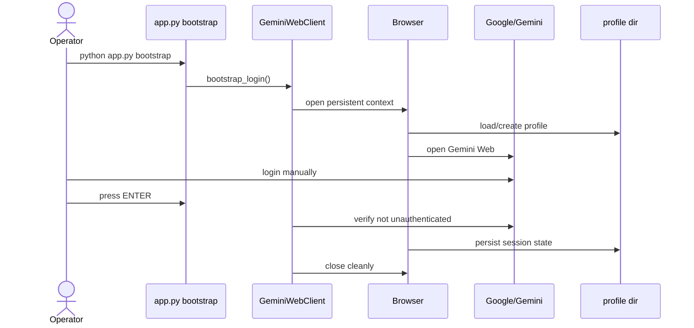
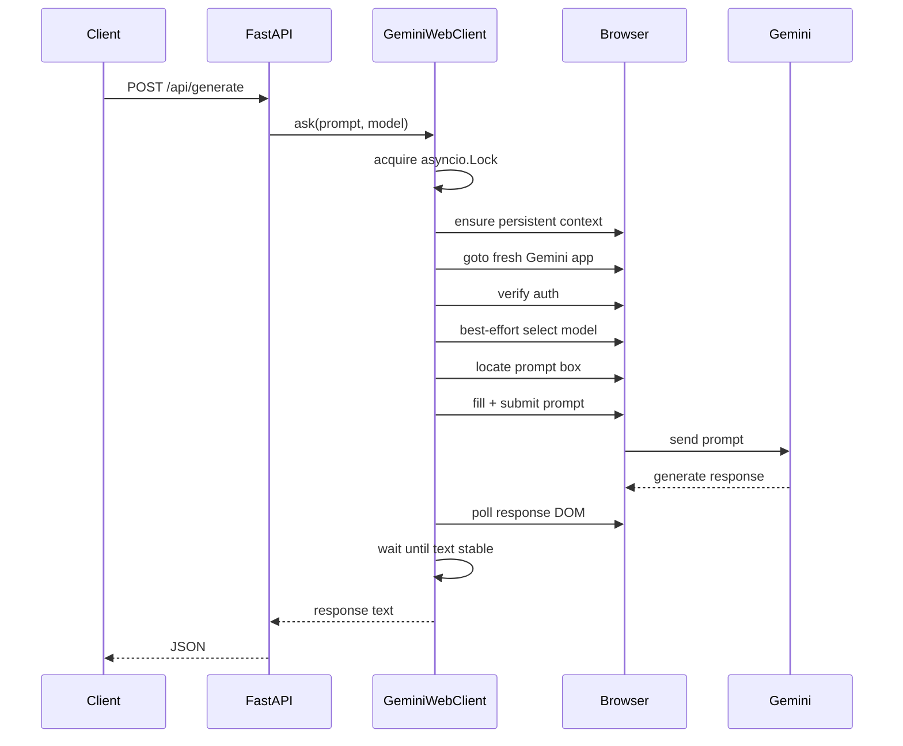
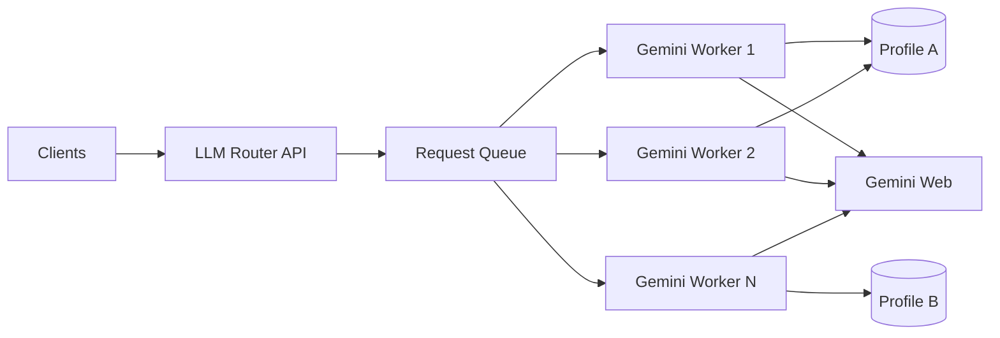

# Gemini Web Python Service — Kiến trúc và nghiệp vụ

## 1. Mục tiêu

Service này cung cấp một lớp HTTP API để ứng dụng bên ngoài gọi Gemini thông qua **Gemini Web đã đăng nhập sẵn trên trình duyệt**, thay vì gọi Gemini API trực tiếp.

Mục tiêu chính:

- Chỉ cần đăng nhập Google/Gemini một lần trong bước bootstrap.
- Duy trì trạng thái đăng nhập bằng một browser profile riêng trên disk.
- Sau khi service restart, profile cũ được tái sử dụng và không cần đăng nhập lại nếu session Google vẫn còn hợp lệ.
- Có API riêng đơn giản cho Gemini Web.
- Có endpoint tương thích định dạng OpenAI để dễ tích hợp vào LLM Router, agent hoặc ứng dụng đang dùng OpenAI-style client.
- Có UI tối giản để kiểm tra health và gửi prompt thủ công.
- Tách logic phụ thuộc DOM Gemini Web vào một module duy nhất để dễ sửa khi UI Gemini thay đổi.

## 2. Phạm vi hiện tại

### Có trong bản hiện tại

- Python-only.
- FastAPI + Uvicorn.
- Playwright async.
- Persistent browser profile.
- Bootstrap đăng nhập thủ công một lần.
- Health check trạng thái session.
- Gửi prompt và đọc response từ Gemini Web.
- Endpoint `/api/generate`.
- Endpoint OpenAI-compatible `/v1/chat/completions`.
- UI test đơn giản tại `/`.
- Request được serialize để tránh nhiều caller cùng thao tác một tab.
- Mỗi request bắt đầu từ URL Gemini mới để giảm nguy cơ lẫn context giữa các request.

### Chưa có trong bản hiện tại

- Streaming/SSE.
- Multi-tab worker pool.
- Nhiều tài khoản/profile cùng lúc.
- Conversation persistence theo `conversation_id`.
- Queue phân tán.
- Auth cho API nội bộ.
- Rate limit.
- Metrics/Prometheus.
- Selector auto-recovery khi Gemini Web thay DOM.
- Bảo đảm tuyệt đối session tồn tại vĩnh viễn; Google vẫn có thể revoke hoặc yêu cầu login lại.

---

## 3. Kiến trúc tổng thể



### Thành phần chính

#### `app.py`

Vai trò:

- Khởi tạo FastAPI.
- Khai báo HTTP contract.
- Chuyển request từ client thành prompt.
- Trả response theo format nội bộ hoặc OpenAI-compatible.
- Chạy bootstrap và Uvicorn.
- Chứa UI HTML rất nhỏ để demo.

Các endpoint:

- `GET /`
- `GET /health`
- `POST /api/generate`
- `POST /v1/chat/completions`

#### `gemini_web.py`

Vai trò:

- Quản lý Playwright lifecycle.
- Mở browser bằng persistent profile.
- Kiểm tra trạng thái login.
- Điều hướng đến Gemini Web.
- Tìm prompt box.
- Gửi prompt.
- Chờ model sinh xong.
- Trích xuất text response.
- Best-effort chọn model trên UI.
- Serialize request bằng `asyncio.Lock`.

#### `var/gemini-profile/`

Đây là state quan trọng nhất của service.

Nó chứa browser profile đã đăng nhập, bao gồm browser storage cần thiết để Chrome/Chromium khôi phục session hiện tại.

Không nên commit thư mục này lên Git, copy công khai hoặc dùng chung giữa nhiều tiến trình browser đồng thời.

---

## 4. Quyết định kiến trúc chính

### 4.1 Persistent browser profile thay vì lưu cookie rời

Service không dựa vào một file `cookies.json` độc lập. Nó dùng `launch_persistent_context()` với một `user_data_dir` cố định.

```text
var/gemini-profile
```

Lợi ích:

- Browser tự quản lý cookies và site storage.
- Restart Python không làm mất session.
- Không phải tự đồng bộ nhiều loại browser state.
- Gần với cách một người dùng giữ nguyên Chrome profile qua nhiều lần mở/đóng trình duyệt.

### 4.2 Profile riêng cho service

Không sử dụng Chrome profile cá nhân mặc định của người dùng.

Lý do:

- Giảm xung đột file lock.
- Tách biệt session của service với browser dùng hằng ngày.
- Dễ backup/xóa/re-bootstrap.
- Dễ chạy dưới service account hoặc deployment riêng sau này.

### 4.3 Một browser context + một tab ở bản đầu

Bản hiện tại ưu tiên tính đơn giản và ổn định hơn throughput.

Mỗi request dùng cùng một page nhưng được bảo vệ bởi:

```python
asyncio.Lock()
```

Do đó tại một thời điểm chỉ có một request được thao tác browser.

### 4.4 Mỗi request mở một chat mới

Trước khi gửi prompt, client điều hướng lại:

```text
https://gemini.google.com/app
```

Mục đích:

- Tránh request B vô tình kế thừa lịch sử của request A.
- Hành vi gần với stateless HTTP API.
- Phù hợp với router/agent backend hơn một conversation browser duy nhất kéo dài.

Đây là trade-off: không có conversation memory tự nhiên giữa các API call. Nếu client muốn context, client phải gửi lại context trong prompt/messages.

### 4.5 Model selection là best-effort

Gemini Web có thể thay đổi UI và label model. Service chỉ cố tìm menu/model tương ứng với giá trị `model`.

Nếu không tìm thấy, request vẫn tiếp tục với model hiện đang active/default trên Gemini Web thay vì fail toàn bộ.

---

## 5. Luồng nghiệp vụ

## 5.1 Nghiệp vụ A — Khởi tạo tài khoản lần đầu

Actor: người vận hành service.



Kết quả thành công:

- `var/gemini-profile/` tồn tại.
- Gemini prompt box sử dụng được.
- Những lần chạy service sau có thể reuse session đó.

Nếu Google yêu cầu login lại trong tương lai, chạy lại nghiệp vụ này.

---

## 5.2 Nghiệp vụ B — Khởi động service

Actor: người vận hành hoặc process manager.

Lệnh:

```powershell
python app.py serve
```

Luồng:

1. FastAPI/Uvicorn khởi động.
2. Browser chưa nhất thiết mở ngay vì client dùng lazy startup.
3. Khi `/health` hoặc một request LLM đầu tiên được gọi, Playwright context mới được tạo nếu chưa tồn tại.
4. Context đọc lại `var/gemini-profile/`.
5. Nếu session còn hợp lệ, service sẵn sàng phục vụ request.

---

## 5.3 Nghiệp vụ C — Health check

Endpoint:

```http
GET /health
```

Luồng:

1. Đảm bảo browser context đã chạy.
2. Nếu page chưa ở Gemini, điều hướng đến Gemini.
3. Kiểm tra URL login Google và các nút `Sign in` / `Đăng nhập`.
4. Trả trạng thái.

Ví dụ session hợp lệ:

```json
{
  "ok": true,
  "auth": "ok",
  "url": "https://gemini.google.com/app"
}
```

Ví dụ cần login lại:

```json
{
  "ok": false,
  "auth": "required",
  "url": "..."
}
```

---

## 5.4 Nghiệp vụ D — Gọi Gemini bằng API đơn giản

Endpoint:

```http
POST /api/generate
Content-Type: application/json
```

Request:

```json
{
  "model": "gemini-web",
  "prompt": "Chỉ trả lời: OK"
}
```

Luồng xử lý:



Response:

```json
{
  "model": "gemini-web",
  "text": "OK"
}
```

---

## 5.5 Nghiệp vụ E — Gọi theo OpenAI-compatible format

Endpoint:

```http
POST /v1/chat/completions
```

Request:

```json
{
  "model": "gemini-web",
  "messages": [
    {"role": "system", "content": "Trả lời ngắn gọn."},
    {"role": "user", "content": "2 + 2 bằng mấy?"}
  ],
  "stream": false
}
```

Service nối messages thành một prompt text trước khi gửi Gemini Web.

Hiện tại đây là **OpenAI-compatible về shape chính của request/response**, không phải implementation đầy đủ toàn bộ OpenAI protocol.

`stream=true` chưa hỗ trợ.

---

## 5.6 Nghiệp vụ F — Session hết hạn

Nếu trong quá trình request service phát hiện Google/Gemini yêu cầu login:

- `GeminiWebClient` raise `AuthRequired`.
- `/api/generate` trả HTTP `401` với mã `AUTH_REQUIRED`.
- Operator chạy lại:

```powershell
python app.py bootstrap
```

Không cần xóa source code hay cài lại dependency.

---

## 6. State và vòng đời runtime

```text
Code / config
    │
    ├── app.py
    ├── gemini_web.py
    └── env

Persistent state
    │
    └── var/gemini-profile/

Ephemeral runtime
    │
    ├── Playwright process
    ├── browser context
    ├── Gemini page/tab
    └── asyncio request lock
```

### Khi service restart

Bị mất:

- Browser process.
- Page/tab hiện tại.
- Lock/runtime memory.

Được giữ:

- `var/gemini-profile/`.
- Browser session nếu Google vẫn chấp nhận state đó.

---

## 7. Concurrency model

Hiện tại:

```text
Request A ─┐
Request B ─┼──> asyncio.Lock ──> one Gemini page
Request C ─┘
```

Ưu điểm:

- Tránh prompt bị gõ lẫn nhau.
- Tránh đọc nhầm response của request khác.
- Ít lỗi UI automation hơn.

Nhược điểm:

- Throughput gần như tuần tự.
- Một request dài sẽ chặn request phía sau.

Khi cần scale, hướng nâng cấp hợp lý là page/worker pool, trong đó mỗi worker có page riêng và vẫn dùng cùng hoặc nhiều profile tùy yêu cầu vận hành.

---

## 8. Cơ chế xác định response hoàn thành

Bản hiện tại không phụ thuộc cứng vào nút "Stop generating".

Client liên tục đọc response DOM. Khi response mới:

1. Xuất hiện khác snapshot trước request.
2. Có text.
3. Text không thay đổi khoảng 1.5 giây.

thì coi generation đã hoàn tất và trả text về client.

Mục đích là giảm phụ thuộc vào selector của nút trạng thái vốn có thể thay đổi theo UI Gemini.

---

## 9. Failure model

### `AUTH_REQUIRED`

Nguyên nhân thường gặp:

- Session hết hạn.
- Google revoke session.
- Security challenge.
- Profile chưa bootstrap đúng.

Xử lý:

```powershell
python app.py bootstrap
```

### `Could not find Gemini prompt box`

Khả năng cao:

- Gemini đổi DOM.
- Trang chưa load đúng.
- Account đang ở một màn hình interstitial khác.

Nơi cần sửa:

```python
GeminiWebClient._find_prompt_box()
```

### Không extract được response

Nơi cần kiểm tra:

```python
GeminiWebClient._all_response_texts()
```

### Timeout

Config:

```env
GEMINI_TIMEOUT_MS=120000
```

Có thể tăng nếu model thường trả lời dài.

---

## 10. Security và vận hành

### Bắt buộc giữ kín profile

`var/gemini-profile/` là dữ liệu nhạy cảm vì chứa browser authentication state.

Khuyến nghị:

- Thêm `var/` vào `.gitignore`.
- Không upload profile lên repository.
- Không chia sẻ ZIP có profile đã login.
- Hạn chế quyền truy cập filesystem vào profile.
- Không chạy hai browser process cùng lúc trên cùng một profile.

### API bind mặc định chỉ localhost

```env
HOST=127.0.0.1
```

Đây là mặc định phù hợp cho local LLM router.

Nếu đổi thành `0.0.0.0`, nên bổ sung ít nhất API key/reverse proxy auth trước khi expose ra LAN/Internet.

---

## 11. Cấu hình

Các biến môi trường hiện tại:

| Biến | Mặc định | Ý nghĩa |
|---|---:|---|
| `HOST` | `127.0.0.1` | Host FastAPI bind vào |
| `PORT` | `8787` | Port service |
| `GEMINI_PROFILE_DIR` | `var/gemini-profile` | Persistent browser profile |
| `GEMINI_TIMEOUT_MS` | `120000` | Timeout browser/request |
| `HEADLESS` | `false` | Chạy browser headless hay không |
| `BROWSER_CHANNEL` | `chrome` | Ưu tiên Chrome channel; fallback Chromium |

---

## 12. Hướng mở rộng production

Kiến trúc nâng cấp đề xuất:



Thứ tự nâng cấp hợp lý:

1. Structured logging + request ID.
2. Watchdog/recreate page khi browser/page chết.
3. API key cho local/LAN access.
4. Conversation abstraction nếu cần multi-turn thật.
5. SSE streaming.
6. Worker/page pool.
7. Multi-profile/account routing.
8. Selector adapter/versioning.
9. Metrics và health/readiness tách riêng.

---

## 13. Tóm tắt nghiệp vụ

Service hoạt động theo nguyên tắc:

```text
LOGIN 1 LẦN
    ↓
LƯU SESSION TRONG PERSISTENT PROFILE
    ↓
CLIENT GỌI HTTP API
    ↓
FASTAPI NHẬN REQUEST
    ↓
PLAYWRIGHT MỞ/REUSE GEMINI WEB
    ↓
TẠO CHAT MỚI
    ↓
GỬI PROMPT
    ↓
ĐỌC RESPONSE DOM
    ↓
TRẢ JSON CHO CLIENT
```

Khi Python hoặc máy restart, service chỉ cần mở lại cùng `GEMINI_PROFILE_DIR`. Chỉ khi Google không còn chấp nhận session đó mới cần bootstrap đăng nhập lại.
